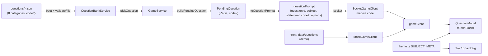

# Logica de Programacao — Design

**Spec**: `.specs/features/logica-programacao/spec.md`
**Context**: `.specs/features/logica-programacao/context.md`
**Status**: Done

---

## Architecture Overview

Não há arquitetura nova: a feature é **conteúdo + um campo opcional que atravessa o pipeline
existente de ponta a ponta**. As decisões D1–D5 fixam a abordagem; a única alternativa real
(código embutido em ``` no `statement`) foi descartada pelo usuário em D4.



O conteúdo é a parte grossa (≥ 288 perguntas); o código é ~6 pontos de contato pequenos.

---

## Code Reuse Analysis

### Existing Components to Leverage

| Component | Location | How to Use |
| --- | --- | --- |
| Loader fail-fast por arquivo | `back/src/questions/question-bank.service.ts` (`validateFile`) | Estender com validação de `code` e de alternativas distintas — mesmo padrão de mensagem `"arquivo"[idx]`. |
| "1 arquivo = 1 matéria" + `subjects()` | idem | Criar 8 JSON novos; nenhuma mudança em `generateBoard`. |
| Projeção única RF-16 | `back/src/game/question.rules.ts` (`toQuestionPrompt`) | Adicionar `code` condicionalmente; continua o único caminho de saída. |
| Fixtures em diretório temporário | `back/src/questions/question-bank.service.spec.ts` (`QUESTIONS_DIR`) | Reusar o helper para casos de `code` inválido. |
| Fallback de slug desconhecido | `front/src/features/board/theme.ts` | Mantido; só trocar entradas de `SUBJECT_META`. |
| Mapeamento explícito de payload | `front/src/game/client/SocketGameClient.ts:349` | Adicionar `code: raw.code`. |
| Seleção de pergunta da demo | `front/src/game/engine/questionPool.ts` (`selectQuestion`) | Sem mudança; só troca o banco. |

### Integration Points

| System | Integration Method |
| --- | --- |
| Contrato WS | Mudança **aditiva**: `questionPrompt.code?: string`. Clients antigos ignoram. |
| Redis | `PendingQuestion` ganha `code?` — serializado em JSON junto com a sessão; sessões em voo sem o campo seguem válidas (opcional). |
| e2e do back | Usam o banco **real** (`<cwd>/questions`). Por isso as categorias novas entram **antes** do arquivamento das antigas (ver ordem das tasks). |

---

## Components

### B1 — Validação de `code` e alternativas (backend)

- **Purpose**: Garantir no boot que o conteúdo novo respeita os limites.
- **Location**: `src/questions/question-bank.service.ts`, `src/questions/question.types.ts`
- **Interfaces**:
  - `Question.code?: string`
  - `validateFile(...)`: se `code` presente → normaliza `\r\n`→`\n`; exige string, `trim() !== ''`, sem `\t`, `≤ 15` linhas, cada linha `≤ 44` chars; exige `correct`, `proximal`, `wrong[0]`, `wrong[1]` distintos (comparação após `trim()`).
  - Constantes exportadas: `CODE_MAX_LINES = 15`, `CODE_MAX_LINE_LENGTH = 44`.
- **Reuses**: padrão de erro `${prefix}: ...` existente.

### B2 — `code` no pipeline de pergunta (backend)

- **Location**: `src/game/question.rules.ts`, `src/questions/question.types.ts`
- **Interfaces**:
  - `PendingQuestion.code?: string` (copiado em `buildPendingQuestion` só se definido)
  - `QuestionPromptView.code?: string` — `toQuestionPrompt` inclui a chave **apenas** quando `pending.code !== undefined` (AC: payload omite a chave sem código).
- **Reuses**: embaralhamento intacto (consome os mesmos 3 valores do rng → testes determinísticos atuais não mudam).

### B3 — Banco de conteúdo (backend)

- **Location**: `questions/<categoria>.json` (8) + `questions/_arquivo/*.json` (8 antigos)
- **Categorias / prefixos / escopo**:

| slug | prefixo | conteúdo |
| --- | --- | --- |
| `algoritmos` | `alg` | sequência de passos, entrada→processamento→saída, ordem das instruções, decomposição de problemas do dia a dia |
| `variaveis-e-tipos` | `var` | declaração, atribuição (`<-`), tipos (inteiro/real/caractere/logico), troca de valores, `div`/`mod`, precedência |
| `condicionais` | `cond` | `se/entao/senao`, aninhamento, `escolha/caso`, faixas de valores |
| `operadores-logicos` | `oplog` | relacionais, `E`/`OU`/`NAO`, tabela-verdade, simplificação de condições |
| `lacos-de-repeticao` | `laco` | `para`, `enquanto`, `repita`; contador, acumulador, laço infinito, aninhados |
| `vetores` | `vet` | índice, percorrer, soma/média, maior/menor, matriz simples (hard) |
| `funcoes` | `func` | parâmetros, retorno, procedimento × função, escopo, recursão (hard) |
| `busca-e-ordenacao` | `bus` | busca linear × binária, bubble/selection sort passo a passo, escolha do algoritmo, nº de comparações (intuição de eficiência) |

- **Formato de pergunta** (mix por categoria): conceito; "qual a saída?"; "complete a lacuna"; "ache o erro"; "qual algoritmo resolve?". O `proximal` modela o erro clássico do iniciante (off-by-one, `=` × `<-`, `E` × `OU`, esquecer de incrementar, divisão inteira).
- **Dialeto**: Portugol/VisuAlg ASCII (spec → Assumptions). Indentação 2 espaços.

### B4 — Content spec do banco real (backend)

- **Location**: `src/questions/question-bank.content.spec.ts` (novo)
- **Purpose**: Travar as regras de conteúdo no CI, carregando o banco real via `QuestionBankService`.
- **Checks**: para cada arquivo carregado de uma categoria nova: ≥ 12 por nível; prefixo do id bate com o mapa; ids únicos globalmente. Task final adiciona: `subjects()` = exatamente as 8.

### F1 — Tipos e mapeamento (front)

- **Location**: `src/game/types.ts`, `src/game/client/SocketGameClient.ts`
- `Question.code?`, `QuestionPromptEvent.code?`, `RawQuestionPrompt.code?`; `BACKEND_SUBJECTS` = 8 slugs novos; socket repassa `code`.

### F2 — `SUBJECT_META` (front)

- **Location**: `src/features/board/theme.ts`
- 8 entradas novas (nome, rótulo ≤ 6, cor, ícone); remove as 8 antigas e as 6 legadas.

| slug | name | label | icon |
| --- | --- | --- | --- |
| `algoritmos` | Algoritmos | Algo | 🧭 |
| `variaveis-e-tipos` | Variáveis e Tipos | Var | 📦 |
| `condicionais` | Condicionais | Se | 🔀 |
| `operadores-logicos` | Operadores Lógicos | E/OU | 🧩 |
| `lacos-de-repeticao` | Laços de Repetição | Laço | 🔁 |
| `vetores` | Vetores | Vetor | 🗃️ (📚 é o ícone de fallback) |
| `funcoes` | Funções | Func | 🧱 |
| `busca-e-ordenacao` | Busca e Ordenação | Busca | 🔍 |

Cores: reaproveitar a paleta vibrante atual (8 hex distintos, contraste com texto branco).

### F3 — `CodeBlock` no `QuestionModal` (front)

- **Location**: `src/features/play/QuestionModal.tsx` (componente local `CodeBlock`, sem arquivo novo — o modal é o único consumidor)
- Renderiza `<pre><code>` com `font-mono`, `whitespace-pre`, `overflow-x-auto`, `max-w-full`, `text-sm`, fundo escuro (slate-900/texto slate-100), `rounded-xl`, entre o `h2` e as alternativas. Não renderiza nada se `code` ausente.

### F4 — Banco da demo (front)

- **Location**: `src/data/questions/*.json` + `index.ts`; `src/game/engine/board.ts` (`SUBJECTS`); `MockGameClient` passa `code` no prompt.
- 8 JSON (≥ 3 perguntas cada, copiadas do banco do back, com `code` quando houver); remove os 10 legados.

### F5 — Textos / docs / cenário

- Home subtitle; READMEs; `CONTRACT.md` (back e front); `CLAUDE.md` e `questions/README.md` do back; P3: `BoardScenery` props temáticos.

---

## Data Models

```typescript
// back: src/questions/question.types.ts
interface Question {
  id: string; subject: Subject; difficulty: QuestionDifficulty
  statement: string
  code?: string            // NOVO — pseudocódigo, ≤15 linhas, ≤44 chars/linha, sem \t
  correct: string; proximal: string; wrong: [string, string]
}
interface PendingQuestion { /* ...atual */ code?: string }        // NOVO
interface QuestionPromptView { questionId; subject; statement; code?: string; options }
```

Exemplo de pergunta:

```json
{
  "id": "laco-0007", "subject": "lacos-de-repeticao", "difficulty": "normal",
  "statement": "O que este algoritmo escreve?",
  "code": "s <- 0\npara i de 1 ate 4 faca\n  s <- s + i\nfimpara\nescreva(s)",
  "correct": "10", "proximal": "6", "wrong": ["4", "1234"]
}
```

---

## Error Handling Strategy

| Error Scenario | Handling | User Impact |
| --- | --- | --- |
| `code` fora dos limites / vazio / com `\t` | Boot falha com `"arquivo"[idx]: campo "code" ...` | Nenhum (CI/dev pega antes do deploy) |
| Alternativas repetidas | Boot falha com índice | Nenhum |
| Categoria esgota o nível | `pickQuestion` → `null` → casa normal (atual) | Casa sem pergunta |
| Client antigo recebe `code` | Ignora chave extra | Vê só o enunciado |
| Linha longa no celular | `overflow-x-auto` no bloco | Rolagem horizontal dentro do bloco |

---

## Risks & Concerns

| Concern | Location | Impact | Mitigation |
| --- | --- | --- | --- |
| Reconexão não reenvia `questionPrompt` (lacuna pré-existente) | `back/src/gateway/game.gateway.ts:231-266` | Jogador que cai com pergunta aberta volta e não vê a pergunta; `rollDice` dá `ANSWER_PENDING` | Fora do escopo; `PendingQuestion.code` garante que um futuro reenvio já sai completo. Sugerido como task separada. |
| e2e dependem do banco real em `<cwd>/questions` | `test/e2e/*` | Arquivar antes de criar as categorias novas quebra o boot dos e2e | Ordem das tasks: 8 categorias novas primeiro, arquivamento por último. |
| Socket do front mapeia campo a campo | `front/src/game/client/SocketGameClient.ts:349` | `code` seria descartado silenciosamente | Task F1 com teste de mapeamento. |
| Correção do conteúdo (respostas de rastreamento) não é verificável por máquina | `questions/*.json` | Resposta errada ensina errado | Autor rastreia cada trecho; Verifier reconfere ≥ 1 por categoria/nível; distrator proximal documenta o erro modelado. |
| `node_modules` ausente nos dois repos | raiz de cada repo | Gates não rodam | `npm ci` antes da 1ª task de cada repo. |
| Testes do front acoplados a matérias legadas | `src/game/engine/board.test.ts`, `questionPool.test.ts`, `features/play/PlayScreen.test.tsx` | Quebram ao trocar o banco da demo | Atualizar na mesma task F4. |

---

## Tech Decisions

| Decision | Choice | Rationale |
| --- | --- | --- |
| Limite de largura | 44 chars/linha | ~375 px com `text-sm` mono dentro do modal com padding; rolagem como rede de segurança. |
| Chave `code` ausente vs `undefined` | Omitida no payload | AC explícito; payload menor; clients antigos intactos. |
| Validação de alternativas distintas | Comparação após `trim()`, case-sensitive | `"Verdadeiro"`/`"verdadeiro"` seria confuso, mas igualdade exata pega o erro real (copiar/colar). |
| Onde fica a spec | Repo do back | Dono do conteúdo e do contrato; front referencia. |

Decisão de projeto para `STATE.md`: **AD-001 — conteúdo do jogo = lógica de programação (8 categorias por conceito, Portugol/VisuAlg ASCII, campo `code?`)**.
