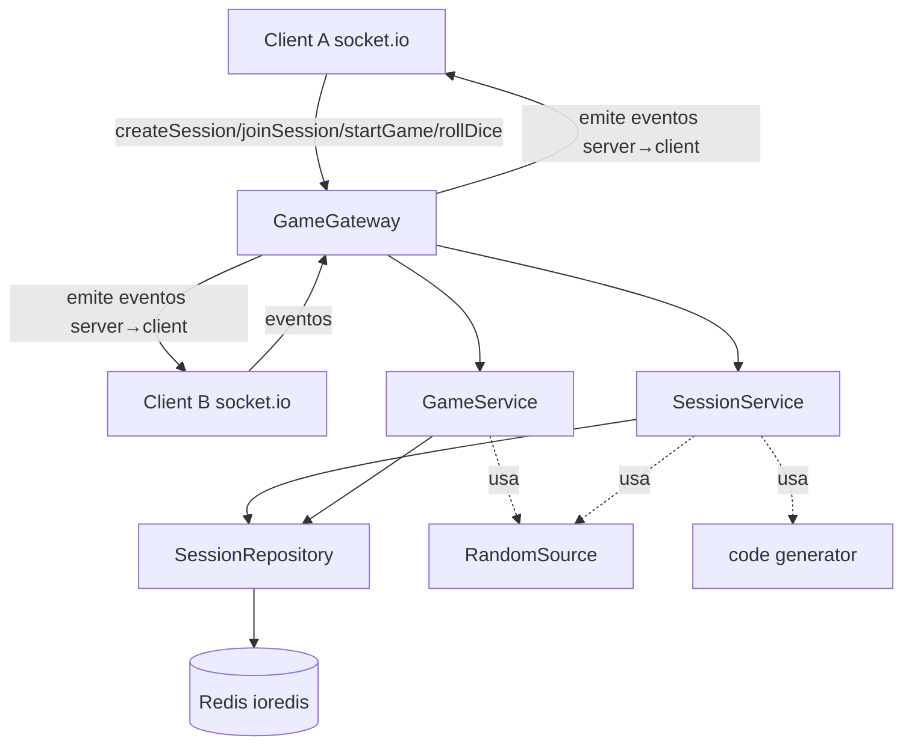

# Sprint 1 — Núcleo Jogável (Backend) Design

**Spec**: `.specs/features/sprint-1-core-loop/spec.md`
**Status**: Draft

---

## Princípio arquitetural

Separar **lógica de jogo pura** (funções determinísticas, testáveis sem rede nem Redis) da
**casca de I/O** (gateway Socket.IO, repositório Redis). Toda regra (ordem, movimento, vitória,
troca de turno) vive em funções/serviços puros; o gateway só traduz eventos ↔ chamadas de serviço
e emite resultados. Isso cumpre a autoridade do servidor (RF-16) e maximiza testabilidade.

A injeção de RNG (`RandomSource`) permite testes determinísticos das regras que dependem de dado.

---

## Architecture Overview



Fluxo de um turno: `rollDice` → Gateway valida remetente → `GameService.applyDiceRoll(state)`
(rola d6, calcula movimento, detecta vitória, avança turno) → `SessionRepository.save(state)` →
Gateway emite `diceResult` e (`turnChanged` ou `gameOver`) para a sala.

---

## Code Reuse Analysis

Projeto greenfield — sem código a reutilizar. Reutilização aqui significa **padrões** consistentes:

| Padrão                         | Aplicação                                                            |
| ------------------------------ | ------------------------------------------------------------------- |
| NestJS modules + DI            | Cada área (redis, session, game, gateway) é um módulo com providers |
| `@WebSocketGateway` (socket.io)| Gateway único com `@SubscribeMessage` por evento client→server      |
| Lifecycle hooks WS             | `OnGatewayConnection`/`OnGatewayDisconnect` para presença            |
| Funções puras + RNG injetável  | Regras de jogo testáveis sem mocks de rede                          |

### Integration Points

| Sistema   | Método de integração                                                         |
| --------- | ---------------------------------------------------------------------------- |
| Redis     | `ioredis` client como provider injetável; `SessionRepository` serializa JSON |
| Socket.IO | Adapter padrão do NestJS; salas = código da sessão (`socket.join(code)`)      |

---

## Estrutura de diretórios

```
src/
  main.ts
  app.module.ts
  common/
    random/
      random.source.ts          # interface RandomSource
      default-random.source.ts   # impl com Math.random / crypto
    errors/
      game-error.ts              # GameError + ErrorCode enum
  redis/
    redis.module.ts
    redis.constants.ts           # REDIS_CLIENT token
    redis.provider.ts            # factory ioredis a partir de env
  session/
    session.types.ts             # SessionState, Player, Board, Difficulty
    session.repository.ts        # CRUD no Redis
    session.service.ts           # lobby: create/join/leave/start
    session.code.ts              # gerador de código #NNNNN
    session.module.ts
  game/
    game.rules.ts                # PURO: rollDie, computeAdvance, resolveMovement,
                                 #       resolveOrder, nextConnectedTurnIndex, buildRanking
    game.service.ts             # orquestra regras + repositório
    game.module.ts
  gateway/
    game.gateway.ts             # @WebSocketGateway, @SubscribeMessage por evento
    gateway.dto.ts              # payloads client→server
    gateway.module.ts
test/
  e2e/
    game-loop.e2e-spec.ts        # 2 clientes socket.io-client jogam até gameOver
```

---

## Components

### RandomSource (`src/common/random/`)

- **Purpose**: abstrair geração aleatória para tornar regras testáveis deterministicamente.
- **Interfaces**:
  - `int(minInclusive: number, maxInclusive: number): number`
  - `rollD6(): number` — açúcar para `int(1,6)`
- **Dependencies**: nenhuma. Impl default usa `crypto.randomInt`.
- **Reuses**: padrão de injeção de dependência do Nest (token providível).

### RedisModule (`src/redis/`)

- **Purpose**: prover um cliente `ioredis` configurado por env como provider global.
- **Interfaces**: exporta provider `REDIS_CLIENT` (instância `Redis`).
- **Dependencies**: `ioredis`, env (`REDIS_HOST`, `REDIS_PORT`).
- **Reuses**: padrão de async provider factory do Nest.

### SessionRepository (`src/session/session.repository.ts`)

- **Purpose**: persistir/recuperar `SessionState` no Redis (fonte única da verdade).
- **Interfaces**:
  - `create(state: SessionState): Promise<void>`
  - `findByCode(code: string): Promise<SessionState | null>`
  - `save(state: SessionState): Promise<void>` — atualiza `lastActivityAt`
  - `exists(code: string): Promise<boolean>`
  - `delete(code: string): Promise<void>`
- **Dependencies**: `REDIS_CLIENT`.
- **Reuses**: chave `session:{code}`, valor JSON. (TTL completo é Sprint 2; aqui set simples.)

### SessionCode (`src/session/session.code.ts`)

- **Purpose**: gerar código `#NNNNN` único entre sessões ativas.
- **Interfaces**: `generateUniqueCode(repo: SessionRepository, rng: RandomSource): Promise<string>`
- **Dependencies**: `SessionRepository` (checar colisão), `RandomSource`.

### SessionService (`src/session/session.service.ts`)

- **Purpose**: regras de lobby — criar sessão, entrar, sair, iniciar.
- **Interfaces**:
  - `createSession(name: string, difficulty: Difficulty, socketId: string): Promise<{state; playerId}>`
  - `joinSession(code: string, name: string, socketId: string): Promise<{state; playerId}>`
  - `leaveSession(code: string, playerId: string): Promise<SessionState | null>`
  - `startGame(code: string, requesterPlayerId: string): Promise<SessionState>` — valida host, ≥2
  - `markDisconnected(socketId: string): Promise<SessionState | null>`
- **Dependencies**: `SessionRepository`, `SessionCode`, `RandomSource`, regras de `game.rules`.
- **Reuses**: validações lançam `GameError(code)` traduzido pelo gateway em evento `error`.

### GameRules (`src/game/game.rules.ts`) — PURO, sem I/O

- **Purpose**: todas as decisões determinísticas do jogo.
- **Interfaces**:
  - `rollDie(rng: RandomSource): number`
  - `computeAdvance(fromSquare: number, diceValue: number): number` — **S1: `from + value`**
  - `resolveMovement(state, playerId, diceValue): { toSquare: number; isWin: boolean }`
  - `resolveOrder(rolls: Roll[], rng): { turnOrder: string[]; rolls: Roll[] }` — desempate recursivo
  - `nextConnectedTurnIndex(state): number` — pula `connected=false`
  - `buildRanking(state, winnerId): RankingEntry[]` — winner 1º, demais por `square` desc
- **Dependencies**: `RandomSource` (passado como argumento, não injetado).
- **Reuses**: ponto de extensão `computeAdvance` (Sprint 3 injeta tiers/dificuldade/nudge).

### GameService (`src/game/game.service.ts`)

- **Purpose**: orquestrar regras + persistência para os eventos de jogo.
- **Interfaces**:
  - `resolveTurnOrder(code: string): Promise<SessionState>`
  - `applyDiceRoll(code: string, playerId: string): Promise<DiceOutcome>`
- **Dependencies**: `SessionRepository`, `GameRules`, `RandomSource`.
- **Reuses**: lança `GameError` para fluxos inválidos (não é a vez, jogo inativo).

### GameGateway (`src/gateway/game.gateway.ts`)

- **Purpose**: ponte Socket.IO ↔ serviços; única camada que toca sockets.
- **Interfaces** (`@SubscribeMessage`): `createSession`, `joinSession`, `startGame`,
  `rollForOrder`, `rollDice`, `leaveSession`; hooks `handleConnection`, `handleDisconnect`.
- **Dependencies**: `SessionService`, `GameService`, server socket.io (`@WebSocketServer`).
- **Reuses**: helper interno `emitError(client, GameError)`; sala = `code`.

---

## Data Models

```typescript
// src/session/session.types.ts
export type Difficulty = 'easy' | 'normal' | 'hard';
export type SessionStatus = 'lobby' | 'playing' | 'finished';
export type TileType = 'start' | 'normal' | 'finish';

export interface Player {
  id: string;
  name: string;
  socketId: string;
  square: number;       // 0 = início
  connected: boolean;
  isHost: boolean;
}

export interface Board {
  size: number;                              // N (FIXO na S1, ex.: 25)
  tileTypeBySquare: Record<number, TileType>; // S1: só {0:'start', N:'finish'}; resto = normal
}

export interface SessionState {
  code: string;
  status: SessionStatus;
  difficulty: Difficulty;     // persistida, inerte na S1
  board: Board;
  players: Player[];
  turnOrder: string[];        // playerId[]
  currentTurnIndex: number;
  winner: string | null;      // playerId
  createdAt: string;          // ISO
  lastActivityAt: string;     // ISO
}

export interface Roll { playerId: string; value: number; }
export interface RankingEntry { playerId: string; name: string; square: number; position: number; }
export interface DiceOutcome {
  state: SessionState;
  playerId: string;
  value: number;
  fromSquare: number;
  toSquare: number;
  isWin: boolean;
}
```

**Constante S1:** `BOARD_SIZE = 25` (fixo). Casas: `0='start'`, `25='finish'`, demais implícitas `normal`.

---

## Error Handling Strategy

`GameError extends Error` carrega um `code: ErrorCode`. O gateway captura e emite
`error{code,message}` ao remetente. Estado nunca é alterado num caminho de erro.

| Cenário                                   | ErrorCode                  | Impacto p/ usuário              |
| ----------------------------------------- | -------------------------- | ------------------------------- |
| Código inexistente/expirado               | `SESSION_NOT_FOUND`        | Mensagem "sessão não encontrada"|
| Lobby cheio (4)                           | `SESSION_FULL`             | Não entra                       |
| Entrar em sessão já iniciada              | `SESSION_ALREADY_STARTED`  | Não entra                       |
| Nome vazio                                | `INVALID_NAME`             | Pede nome válido                |
| `startGame` por não-host                  | `NOT_HOST`                 | Botão ignorado                  |
| `startGame` com <2                        | `NOT_ENOUGH_PLAYERS`       | Aguardar jogadores              |
| `rollDice` fora da vez                    | `NOT_YOUR_TURN`            | Ação rejeitada                  |
| Ação com jogo não-ativo                   | `GAME_NOT_ACTIVE`          | Ação rejeitada                  |
| Ação por quem não está na sessão          | `NOT_IN_SESSION`           | Ação rejeitada                  |

---

## Tech Decisions (não-óbvias)

| Decisão                         | Escolha                              | Racional                                                        |
| ------------------------------- | ------------------------------------ | -------------------------------------------------------------- |
| RNG                             | `crypto.randomInt` atrás de interface| Dado justo + testes determinísticos por injeção                |
| Identidade de sala socket.io    | `socket.join(code)`                  | Broadcast por sessão sem gerenciar listas manuais              |
| Rolagem de ordem                | Resolvida no servidor ao `startGame` | Simplicidade na S1; `rollForOrder` aceito mas pode ser no-op   |
| `playerId`                      | `crypto.randomUUID()`                | Identidade estável p/ reconexão futura (Sprint 2)              |
| Persistência                    | JSON em `session:{code}`             | Sobrevive a restart (RF-16/segurança); TTL fica p/ Sprint 2    |
| Config Redis                    | env `REDIS_HOST`/`REDIS_PORT`        | Mesmo binário roda local e em Docker/VPS sem recompilar        |

---

## Estratégia de testes (alinha com CLAUDE.md: Jest unit + e2e)

- **Unit** (`*.spec.ts` co-locado): `game.rules.ts` (movimento, vitória/clamp, ordem c/ empate,
  next turn pulando desconectado, ranking), `session.code.ts` (unicidade), validações de
  `session.service.ts` e `game.service.ts` (erros) com repositório fake em memória + RNG fake.
- **E2E** (`test/e2e/game-loop.e2e-spec.ts`): app Nest real + `socket.io-client`, 2 clientes,
  partida completa até `gameOver`; cobre o contrato WS. Redis: usar instância local/`ioredis-mock`.
- **Gate**: `quick` = `npm run test`; `full` = `npm run test && npm run test:e2e`;
  `build` = `npm run build && npm run lint && testes`.
