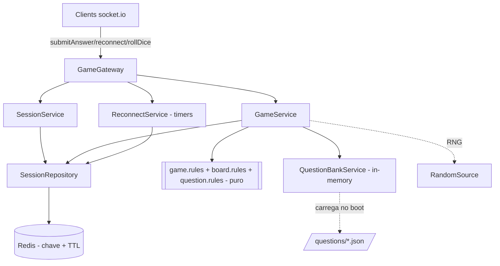

# Sprint 2 — Design (Backend)

**Spec:** `.specs/features/sprint-2-sessions-questions/spec.md`
**Decisões:** `context.md`
**Status:** Draft

---

## Princípio arquitetural (continuidade da S1)

Mantém a separação **regras puras** (`game.rules.ts`, sem I/O, RNG injetado por argumento) vs
**casca de I/O** (gateway, repositório, timers). Toda a nova lógica de jogo (geração de tabuleiro,
tiers, tabela de movimento, nudge, classificação de resposta, seleção de pergunta) entra como
**funções puras testáveis**; serviços orquestram com Redis; o gateway só traduz eventos.

A segurança (RF-16) é estrutural: o `correctIndex` existe apenas em `PendingQuestion`, que vive no
`SessionState` no Redis e nunca é projetado para um payload de saída. Há uma função de projeção
única (`toQuestionPrompt`) que constrói o payload do client a partir do `PendingQuestion`,
garantindo por construção que o segredo não vaze.

---

## Architecture Overview



---

## Componentes — novos e alterados

### NOVO — QuestionBankService (`src/questions/`)

- **Purpose:** carregar os JSON de `/questions/<subject>.json` em memória no boot
  (`OnModuleInit`), validar o schema e servir consultas read-only.
- **Interfaces:**
  - `subjects(): Subject[]`
  - `pickQuestion(subject, excludedIds: Set<string>, rng): Question | null` — sorteia uma
    pergunta da matéria que não esteja em `excludedIds` (checagem **global** — D3). `null` se esgotado.
  - `getById(id): Question | undefined` (para reauditar, não usado no caminho do client).
- **Dependências:** `fs` (boot só), `RandomSource`.
- **Segurança:** estrutura imutável após boot; nunca expõe `Question` cru para o gateway.
- **Validação de schema:** cada item exige `id, subject, statement, correct, proximal, wrong[2]`;
  falha de schema no boot derruba a aplicação (fail-fast) — não há banco silenciosamente quebrado.

### NOVO — board.rules (`src/game/board.rules.ts`) — PURO

- `generateBoard(difficulty, subjects, rng): Board` — implementa a ordem obrigatória da §3.1.
  Sorteia N, reserva 0/N, aloca presídios (RF-18), aloca casas-pergunta por densidade (RF-07),
  atribui matérias. Determinístico sob RNG fixo.
- `DENSITY: Record<Difficulty, number>` = `{ easy:0.4, normal:0.6, hard:0.8 }`.
- `prisonCount(N): number` = `N<=24 ? 1 : 2`.

### NOVO — question.rules (`src/game/question.rules.ts`) — PURO

- `buildPendingQuestion(q: Question, rng): PendingQuestion` — embaralha
  `[correct, proximal, wrong0, wrong1]`, registra `correctIndex`/`proximalIndex`.
- `classifyAnswer(pending, optionIndex): 'none' | 'proximal' | 'wrong'` — mapeia o índice.
- `toQuestionPrompt(pending): { questionId, statement?, options }` — projeção **segura** para o
  client (sem índices/correct). `statement` vem da pergunta; ver nota de acoplamento abaixo.

> Acoplamento `statement`: `PendingQuestion` guardará também `statement` para a projeção não
> precisar reconsultar o banco. `statement` é público (vai no prompt), então não é segredo.

### ALTERADO — game.rules (`src/game/game.rules.ts`)

- `computeAdvance` deixa de ser `from+value`. Novo conjunto:
  - `computeTier(state, playerId): 'leader' | 'middle' | 'last'` (§3.2).
  - `advanceFor(difficulty, tier): number` — tabela §4 (C_d + T_p).
  - `recoilFor(difficulty, errorType): number` — tabela de recuo.
  - `applyNudge(board, target, rng): number` — desvia de `question`/`prison` com P=0.7 (§3.3).
  - `resolveCorrectMovement(state, playerId, rng): MovementResult` — advance→nudge→clamp.
  - `resolveErrorMovement(state, playerId, errorType): MovementResult` — recuo→clamp≥1 (sem trigger).
- `resolveMovement` (dado) passa a devolver também o `tileType` de destino para a aterrissagem.
- `rollDie`, `resolveOrder`, `nextConnectedTurnIndex`, `buildRanking` permanecem.

> Compatibilidade: a assinatura pública de `computeAdvance` muda. Como S1 a isolou exatamente para
> isto (ver STATE.md), a substituição é o ponto de extensão previsto — não um refactor estrutural.

### ALTERADO — GameService (`src/game/game.service.ts`)

- `applyDiceRoll`: após mover, classifica a casa (§3.6):
  - `question` → cria `pendingQuestion` (via QuestionBank + question.rules), persiste, retorna
    sinal "prompt" (gateway emite `questionPrompt`); turno **não** passa.
  - `prison` → `skipTurns++`, persiste, passa turno (RF-19/20).
  - else → fluxo S1 (vitória/turno).
- `submitAnswer(code, playerId, questionId, optionIndex)`: valida turno ativo, pendência,
  `questionId` casado, `optionIndex ∈ [0,3]`; classifica; aplica movimento (acerto: correct-movement
  + possível encadeamento; erro: recuo, sem trigger); limpa `pendingQuestion`; persiste; retorna
  resultado (+ próximo `pendingQuestion` se encadeou). **Acerto que cai em `question` re-arma
  pendência sem trocar turno** (RF-11).
- `startTurnSkipIfNeeded(code)`: se o jogador da vez tem `skipTurns>0`, decrementa, passa turno,
  sinaliza `turnSkipped` (RF-20). Chamado pelo gateway após cada `turnChanged`.
- Seleção de pergunta usa `state.servedQuestionIds` (global) como `excludedIds`; ao servir,
  adiciona o id a `servedQuestionIds` e ao `usedQuestionIds` do jogador.

### NOVO — ReconnectService / timers (`src/session/reconnect.service.ts`)

- **Purpose:** gerenciar o grace period (D2) sem poluir o gateway.
- `armDisconnect(code, playerId, onExpire)`: agenda `setTimeout(5min)`; chave `${code}:${playerId}`.
- `cancel(code, playerId)`: limpa o timer na reconexão.
- `reconnect(code, playerId, socketId)`: valida player na sessão, revincula, `connected=true`.
- Na expiração: remove o jogador; se a sessão ficar sem ninguém conectado/presente, apaga do Redis
  e dispara `sessionClosed`. Usa `SessionRepository`.
- Mapa de timers em memória (`Map<string, NodeJS.Timeout>`). Single-node (D2).

### ALTERADO — SessionRepository

- `save`/`create` passam a aplicar **TTL** (`SET ... EX <ttl>`), deslizante a cada `save`
  (backstop de RF-15). Constante `SESSION_TTL_SECONDS` (ex.: 1800) — folga sobre os 5 min de grace.
- Novo `touchTtl(code)` opcional para renovar sem reserializar (otimização; não obrigatório na S2).

### ALTERADO — GameGateway

- Novos `@SubscribeMessage`: `submitAnswer`, `reconnect`.
- `handleDisconnect`: além do atual, arma o timer de grace (ReconnectService).
- Emite novos eventos: `questionPrompt` (via `toQuestionPrompt`), `answerResult`, `turnSkipped`,
  `playerReconnected`, `sessionClosed`.
- Após qualquer `turnChanged`, chama `startTurnSkipIfNeeded` em laço até cair num jogador sem skip
  (cobre múltiplos presos em sequência).
- DTOs novos com validação estrita (ver abaixo).

---

## Validação de input (segurança)

DTOs validados antes de tocar serviço. Padrão atual do projeto (`gateway.dto.ts`) é checagem manual
tipada; manter o mesmo estilo (sem introduzir `class-validator` se o projeto não usa) **ou** adotar
`ValidationPipe` com whitelist se já presente — decidir na Task S2-11 conforme o que existe.

- `SubmitAnswerDto`: `questionId` string não-vazia; `optionIndex` inteiro em `[0,3]`. Fora disso →
  `INVALID_OPTION` / `QUESTION_MISMATCH`, sem alterar estado.
- `ReconnectDto`: `code` 5 dígitos; `playerId` UUID. Falha → `RECONNECT_FAILED`.

---

## Estrutura de diretórios (adições)

```
src/
  questions/
    question.types.ts          # Question, Subject
    question-bank.service.ts    # loader + pickQuestion (OnModuleInit)
    question-bank.module.ts
  game/
    board.rules.ts             # generateBoard, density, prisonCount   [PURO]
    question.rules.ts          # buildPendingQuestion, classify, toQuestionPrompt [PURO]
    game.rules.ts              # + tiers, advance/recoil tables, nudge  [PURO, alterado]
  session/
    reconnect.service.ts       # timers de grace + expiração
questions/                     # banco JSON (fora de src/, carregado por path)
  matematica.json
  ...                          # fixtures mínimas por matéria na S2
test/e2e/
  questions-loop.e2e-spec.ts   # partida com pergunta + segurança
  reconnect.e2e-spec.ts        # grace period
  prison.e2e-spec.ts           # perda de turno
```

---

## Error Handling — novos códigos

| Cenário | ErrorCode |
|---------|-----------|
| `submitAnswer` sem pergunta pendente | `NO_PENDING_QUESTION` |
| `optionIndex` fora de `[0,3]` ou tipo inválido | `INVALID_OPTION` |
| `questionId` não casa com a pendência | `QUESTION_MISMATCH` |
| `reconnect` com player/sessão inválidos ou fora da janela | `RECONNECT_FAILED` |
| Banco esgotado para a matéria da casa | `NO_QUESTIONS_AVAILABLE` |

`NO_QUESTIONS_AVAILABLE` é defensivo: com fixtures mínimas + no-repeat global, uma partida longa
pode esgotar uma matéria. Fallback de design: se a matéria da casa esgotar, tratar a casa como
`normal` naquele pouso (não trava a partida) e logar — **decidir na Task S2-06**; o ErrorCode fica
reservado para o caso de querer sinalizar explicitamente.

---

## Tech Decisions (não-óbvias)

| Decisão | Escolha | Racional |
|---------|---------|----------|
| Segredo da resposta | `PendingQuestion.correctIndex` só no Redis | RF-16 estrutural; projeção única `toQuestionPrompt` |
| No-repeat | `servedQuestionIds` global na sessão | D3; satisfaz "mesma casa, perguntas diferentes" de graça |
| Grace period | `setTimeout` in-process + TTL Redis | D2; single-node, sem keyspace-events |
| Banco de perguntas | JSON carregado no boot, imutável | SPEC §5; sem Postgres; fail-fast no schema |
| Nudge | RNG injetado, P=0.7 testável nos 2 ramos | determinismo de teste |
| Encadeamento | re-arma `pendingQuestion` sem trocar turno | RF-11 sem recursão de I/O |
| Mudança de `computeAdvance` | substituir, não estender | ponto de extensão previsto na S1 (STATE.md) |

---

## Estratégia de testes

- **Unit puro** (alta cobertura, sem Redis):
  - `board.rules`: N no range, contagem de presídios por faixa, densidade correta por dificuldade,
    0/N reservados, exclusividade de tipos, subjects só em `question`.
  - `game.rules`: tiers (incl. empates e 2 jogadores), tabela de avanço (9 células), recuo (6),
    nudge nos dois ramos de P=0.7 (RNG fixo), encadeamento, clamp (≥1 e vitória).
  - `question.rules`: shuffle determinístico, `classifyAnswer` para cada tipo, `toQuestionPrompt`
    **não contém** `correct`/índices (asserção de segurança no nível de unidade também).
  - `question-bank.service`: schema válido carrega; schema inválido falha; `pickQuestion` respeita
    exclusão global e retorna `null` no esgotamento.
- **Unit de serviço** (repo fake em memória + RNG fake): `submitAnswer` (todos os ramos + erros),
  `applyDiceRoll` com aterrissagem em cada tipo de casa, `startTurnSkipIfNeeded`, reconexão.
- **E2E** (`socket.io-client` + app real, `ioredis-mock`/Redis local):
  - `questions-loop`: partida com pergunta até `gameOver` + **asserção de segurança** no payload.
  - `prison`: RNG forçado, perda de exatamente um turno.
  - `reconnect`: desconecta/reconecta na janela; expiração apaga a chave.
- **Gates:** `quick`=`npm run test`; `full`=`+ npm run test:e2e`; `build`=`+ build && lint`.
